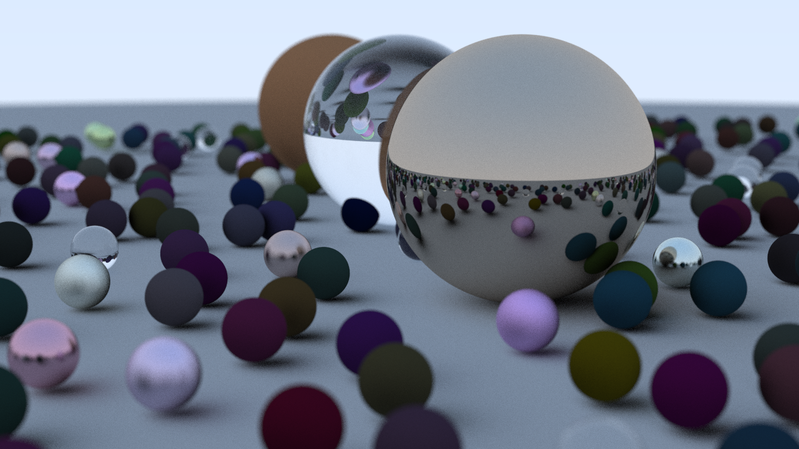
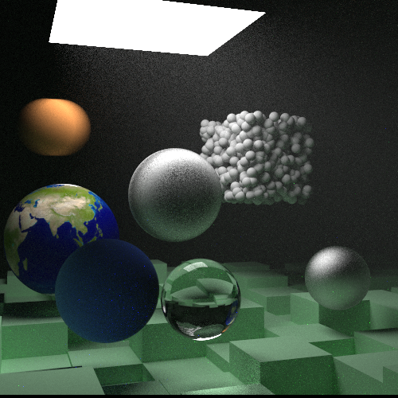

# Raytracing in rust

Rust implementation of "Ray Tracing in One Weekend", "Ray Tracing The Next Week" and "Ray Tracing The Rest of Your Life"

## Examples
There are 3 examples:
- `cornel_box`
- `final_scene`
- `spheres`

To run examles:

```rust
cargo run --release --example spheres
```



